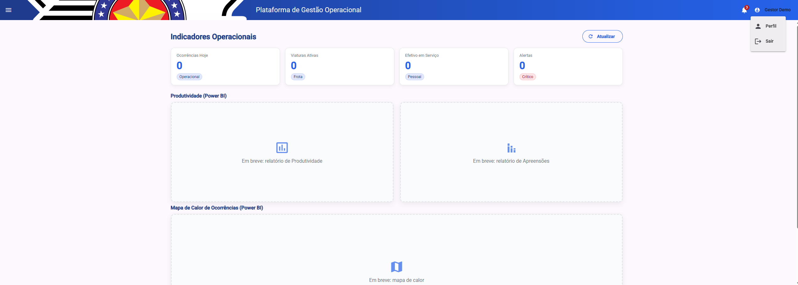
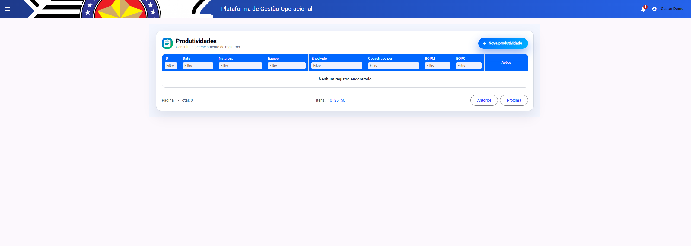
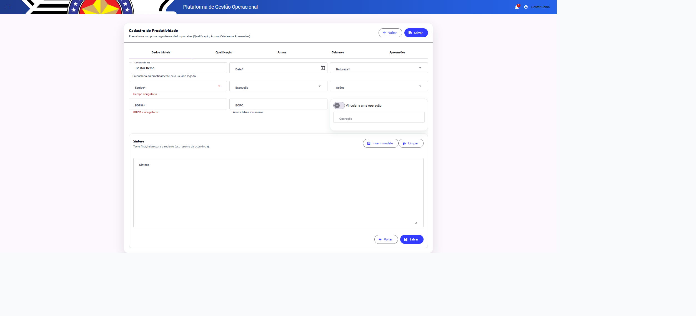
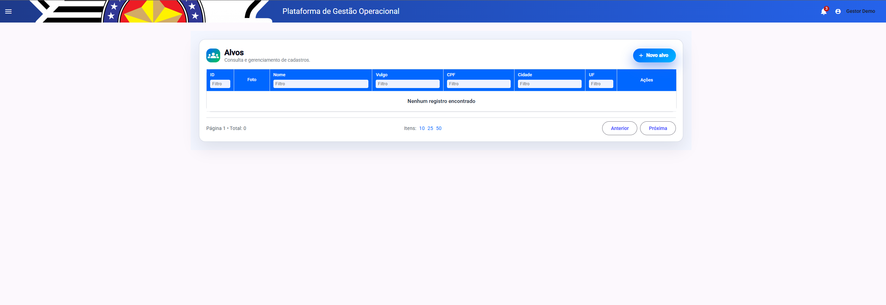
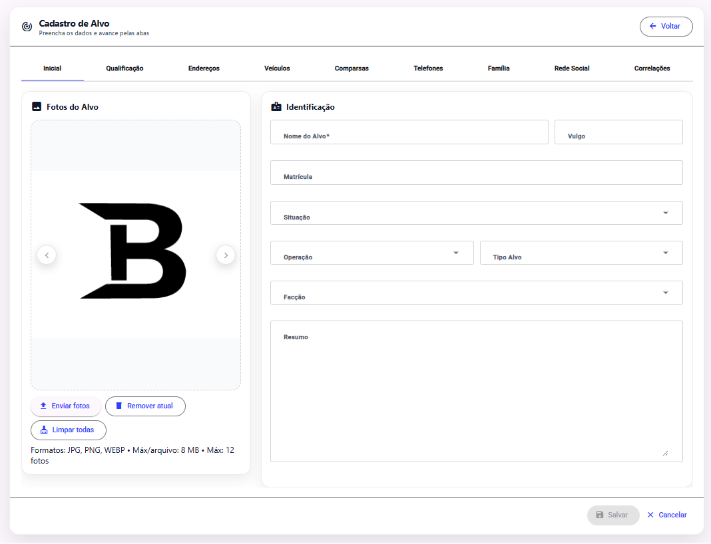
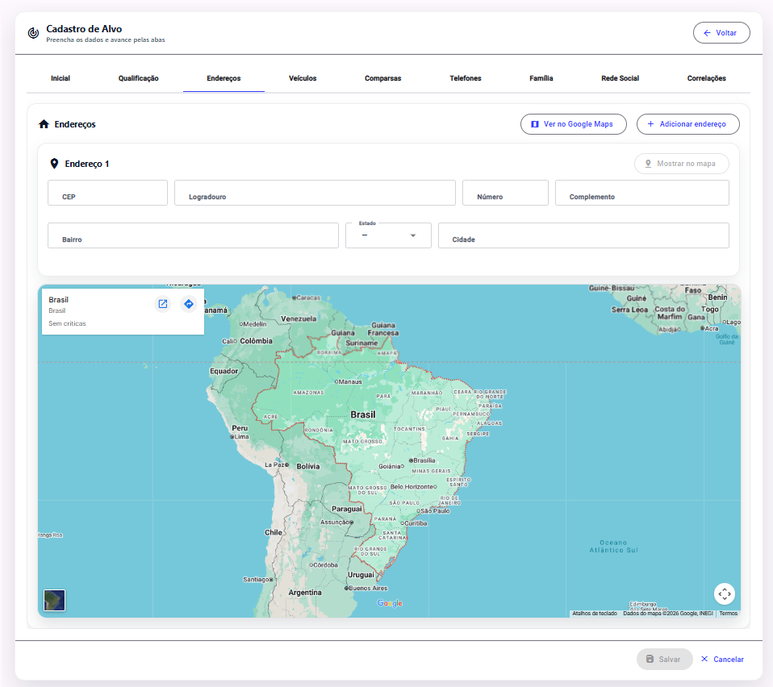
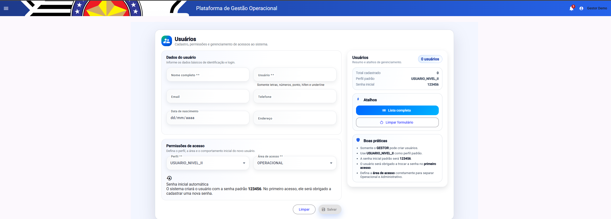
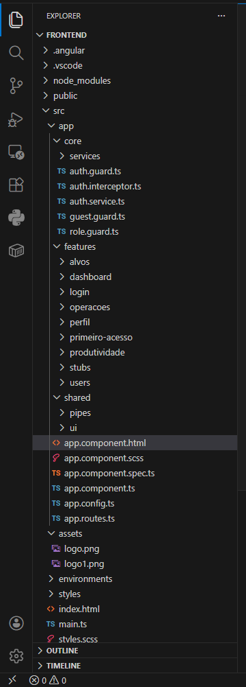
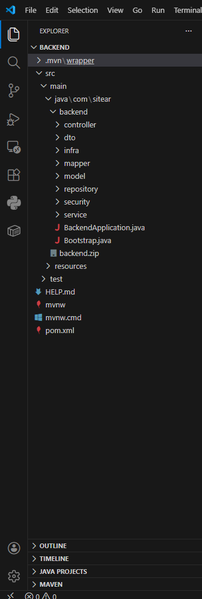

# 🚀 Plataforma de Gestão Operacional (Demo)

> 💡 Sistema web completo desenvolvido com Angular e backend em Java (Spring Boot), simulando um ambiente real de gestão operacional com controle de acesso por perfil, cadastro de dados e interface moderna.

---

## 📌 Sobre o projeto

A **Plataforma de Gestão Operacional** é uma aplicação web desenvolvida com foco em organização, controle e gerenciamento de informações operacionais.

O sistema foi projetado com arquitetura modular, separando responsabilidades por domínio (Alvos, Produtividade, Usuários, Operações), seguindo boas práticas modernas de desenvolvimento.

🚧 **Status:** Em desenvolvimento contínuo  
📦 **Tipo:** Projeto demonstrativo (demo)

---

## 🚀 Diferenciais Técnicos

- Arquitetura modular baseada em features
- Angular com Standalone Components (sem NgModules)
- Controle de acesso por perfil (RBAC)
- Integração com mapas (geolocalização)
- Formulários dinâmicos com múltiplas abas
- Estrutura preparada para logs e auditoria
- Frontend desacoplado do backend (API REST)

---

## ⚙️ Funcionalidades

- 🔐 Autenticação com controle de acesso por perfil  
- 📊 Dashboard com indicadores operacionais  
- 🎯 Gestão de Alvos (cadastro completo)  
- 📈 Cadastro e consulta de Produtividade  
- 👥 Gerenciamento de Usuários  
- 📂 Módulo de Operações  
- 🗺️ Integração com mapas  
- 📑 Base para relatórios e logs  
- 🎨 Interface moderna com Angular Material  

---

## 🧩 Casos de Uso

Este sistema pode ser utilizado para:

- Gestão operacional de equipes
- Controle de produtividade
- Monitoramento de dados estratégicos
- Organização de operações
- Apoio à tomada de decisão com dashboards

---

## 🧠 Tecnologias utilizadas

### Frontend
- Angular
- TypeScript
- Angular Material
- RxJS
- HTML5 + SCSS

### Backend (arquitetura do projeto real)
- Java
- Spring Boot
- Spring Security (JWT)
- JPA / Hibernate
- PostgreSQL

---

## 🏗️ Arquitetura

### Frontend

- core → autenticação, guards e serviços globais  
- features → módulos do sistema  
- shared → componentes reutilizáveis  

### Backend

- Controller → Service → Repository  
- DTOs para comunicação  
- API REST estruturada  
- Segurança com JWT  

---

## 📸 Interface

### 📊 Dashboard


### 📈 Produtividade



### 🎯 Alvos




### 👥 Usuários


---

## 🏗️ Estrutura do Projeto

### Frontend


### Backend


---

## 🔄 Como executar

### Pré-requisitos
- Node.js 18+
- Angular CLI

### Passos

```bash
git clone https://github.com/braianrodrigues/site-demo.git
cd site-demo
npm install
ng serve
```

Acesse:
http://localhost:4200

---

## 🔐 Acesso (modo demo)

Usuário: gestor  
Senha: 123456  

---

## 📌 Roadmap

- [x] Autenticação
- [x] Gestão de Alvos
- [x] Produtividade
- [x] Usuários
- [ ] Relatórios avançados
- [ ] Auditoria completa


---

## 🔒 Observação

Este repositório é uma versão demonstrativa.

A versão completa inclui:

- Backend completo em Spring Boot
- Integração com banco de dados
- Autenticação real via JWT
- Regras de negócio completas

Não disponibilizado por motivos de segurança.

---

## 👨‍💻 Autor

Braian Rodrigues  
Desenvolvedor Full Stack
